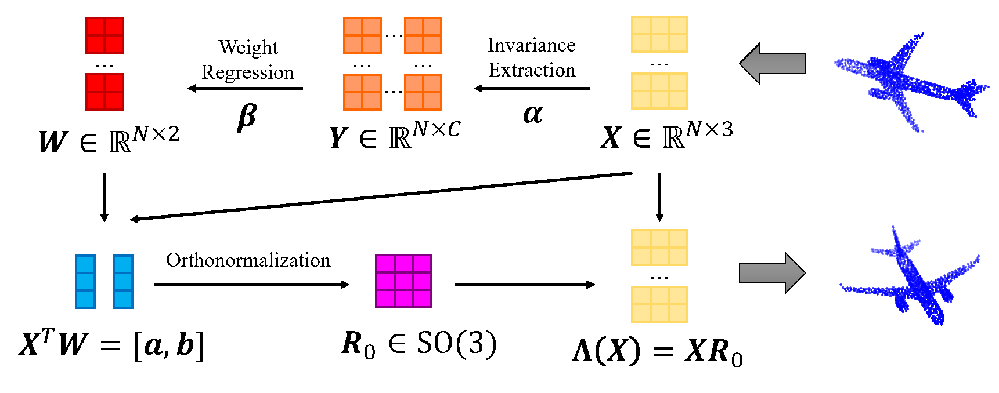

# EIP



Official PyTorch implementation for the following paper:

**Incorporating Rotation Invariance with Non-invariant Networks for Point Clouds**

*by Jiajun Fei, Zhidong Deng*

**TL;DR:** We propose a novel rotation invariant representation learning method for point clouds named EIPs, which bridge the gap between the non-invariant point cloud representation learning and the invariant one. With EIPs, well-performed non-invariant networks can be easily deployed in invariant tasks and applications.

## OpenPoints

The repository is built upon OpenPoints, which is a library built for fairly benchmarking and easily reproducing point-based methods for point cloud understanding. It is born in the course of [PointNeXt](https://github.com/guochengqian/PointNeXt) project and is used as an engine therein.

**For any question related to OpenPoints, please open an issue in [PointNeXt](https://github.com/guochengqian/PointNeXt) repo.**

### Citation

```tex
@Article{qian2022pointnext,
  author  = {Qian, Guocheng and Li, Yuchen and Peng, Houwen and Mai, Jinjie and Hammoud, Hasan and Elhoseiny, Mohamed and Ghanem, Bernard},
  title   = {PointNeXt: Revisiting PointNet++ with Improved Training and Scaling Strategies},
  journal = {arXiv:2206.04670},
  year    = {2022},
}
```

We modify OpenPoints in the following aspects:
* Implement EIP under `openpoints/models/pose`.
* Add `validate_so3` support in `examples/classification/train.py` and `examples/shapenetpart/main.py`.
* Remove most unrelated files and packages.
* Make some other slight modifications. 

## Requirements

```
conda create -n eip -y python=3.7
conda activate eip
conda install -y pytorch=1.10.1 torchvision cudatoolkit=11.3 -c pytorch -c nvidia
pip install -r requirements.txt
cd openpoints/cpp/pointnet2_batch
python setup.py install
```

## Datasets

Fill in the datasets path of all `cfgs/DATASET/default.yaml`. OpenPoints support automatic downloading and processing.

## Train & Test

### Point Cloud Classification

```
# train
CUDA_VISIBLE_DEVICES=$GPUs python examples/classification/main.py --cfg $cfg

# test so(3)
CUDA_VISIBLE_DEVICES=$GPUs python examples/classification/main.py --cfg $cfg --pretrained_path $ckpt_path --mode test_so3 --so3_mode random_rot --num_rot 1
```

### Point Cloud Part Segmentation

```
# train
CUDA_VISIBLE_DEVICES=$GPUs python examples/shapenetpart/main.py --cfg $cfg

# test so(3)
CUDA_VISIBLE_DEVICES=$GPUs python examples/shapenetpart/main.py --cfg $cfg --pretrained_path $ckpt_path --mode test_so3 --so3_mode random_rot --num_rot 1
```

### Release checkpoints

We release all EIP checkpoints with log files. You can get our results by unzipping the downloaded file under `release_ckpt/` and running `evaluate.sh`. Download links: [[百度网盘]](https://pan.baidu.com/s/1tZxvLxZRu-VjtzCRpnj0PA?pwd=wm6r)、[[Google Drive]](https://drive.google.com/file/d/1NTvzHTfzko5_ZRU7PRnlGPjNPoUsc3Kf/view?usp=sharing).

## Acknowledgements

Our codes are built upon [OpenPoints](https://github.com/guochengqian/openpoints/). Thanks to their excellent works!

## Reference

```
placeholder
```